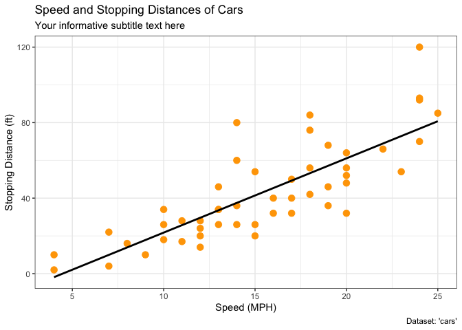

# Class 5: Data Visualization with ggplot
Kalodiah Toma (PID: A07606689)

\##Using GGPLOT

To use ggplot2 we first need to install it on our computers. To do this
we will use the function `install.packages()`.

Before I use any package functions I have to load them up with a
`library()` call, like so:

``` r
library(ggplot2)
ggplot(cars)
```


``` r
head(cars)
```

      speed dist
    1     4    2
    2     4   10
    3     7    4
    4     7   22
    5     8   16
    6     9   10

There is always the “base R” graphics system, i.e `plot()`. To use
ggplot I need to spell out at least 3 things: -data (the stuff I want to
plot as a data.frame) -aesthetics (aes () values - how the data map to
the plot, color, shape, size, etc). -geoms (how I want things drawn,
lines, heat maps, etc.)

``` r
ggplot(cars) +
  aes(x=speed, y=dist)+
  geom_point(col="orange", size=3, alpha = 1) +
  labs(title="Speed and Stopping Distances of Cars",
       x="Speed (MPH)", 
       y="Stopping Distance (ft)",
       subtitle = "Your informative subtitle text here",
       caption="Dataset: 'cars'") +
  geom_smooth(method="lm", se=FALSE, col="black") +
  theme_bw()
```

    `geom_smooth()` using formula = 'y ~ x'



url \<-
“https://bioboot.github.io/bimm143_S20/class-material/up_down_expression.txt”
genes \<- read.delim(url) head(genes)

``` r
url <- "https://bioboot.github.io/bimm143_S20/class-material/up_down_expression.txt"
genes <- read.delim(url)
head(genes)
```

            Gene Condition1 Condition2      State
    1      A4GNT -3.6808610 -3.4401355 unchanging
    2       AAAS  4.5479580  4.3864126 unchanging
    3      AASDH  3.7190695  3.4787276 unchanging
    4       AATF  5.0784720  5.0151916 unchanging
    5       AATK  0.4711421  0.5598642 unchanging
    6 AB015752.4 -3.6808610 -3.5921390 unchanging

``` r
nrow(genes)
```

    [1] 5196

``` r
colnames(genes) 
```

    [1] "Gene"       "Condition1" "Condition2" "State"     

``` r
ncol(genes)
```

    [1] 4

``` r
table(genes$State)
```


          down unchanging         up 
            72       4997        127 

``` r
round( table(genes$State)/nrow(genes) * 100, 2 )
```


          down unchanging         up 
          1.39      96.17       2.44 

use table () table name \$ column name to get column information How
many are “up”

``` r
sum(genes$State == "up")
```

    [1] 127

``` r
url <- "https://bioboot.github.io/bimm143_S20/class-material/up_down_expression.txt"
genes <- read.delim(url)

table(genes$State)
```


          down unchanging         up 
            72       4997        127 

``` r
library(ggplot2)

p <- ggplot(genes) + 
  aes(x=Condition1, y=Condition2, col=State) +
  geom_point() 
p
```


``` r
p + scale_color_manual(values=c("blue","gray","red")) +
    labs(title="Gene Expresion Changes Upon Drug Treatment",
         x="Control (no drug) ",
         y="Drug Treatment")
```

``` r
# File location online
url <- "https://raw.githubusercontent.com/jennybc/gapminder/master/inst/extdata/gapminder.tsv"
gapminder <- read.delim(url)
# install.packages("dplyr")  ## un-comment to install if needed
library(dplyr)
```


    Attaching package: 'dplyr'

    The following objects are masked from 'package:stats':

        filter, lag

    The following objects are masked from 'package:base':

        intersect, setdiff, setequal, union

``` r
gapminder_2007 <- gapminder %>% filter(year==2007)
```

``` r
ggplot(gapminder_2007) + 
  geom_point(aes(x = gdpPercap, y = lifeExp,
                 size = pop), alpha=0.5) + 
  scale_size_area(max_size = 10)
```


``` r
gapminder_1957 <- gapminder %>% filter(year==1957)
ggplot(gapminder_1957) + 
  aes(x = gdpPercap, y = lifeExp, color=continent,
                 size = pop) +
  geom_point(alpha=0.7) + 
  scale_size_area(max_size = 15)
```


``` r
gapminder_1957 <- gapminder %>% filter(year==1957 | year==2007)

ggplot(gapminder_1957) + 
  geom_point(aes(x = gdpPercap, y = lifeExp, color=continent,
                 size = pop), alpha=0.7) + 
  scale_size_area(max_size = 10) +
  facet_wrap(~year)
```


